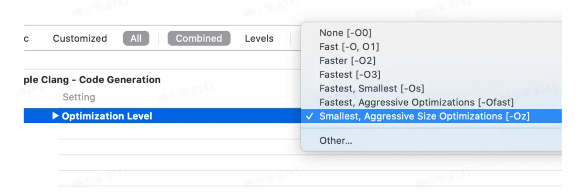
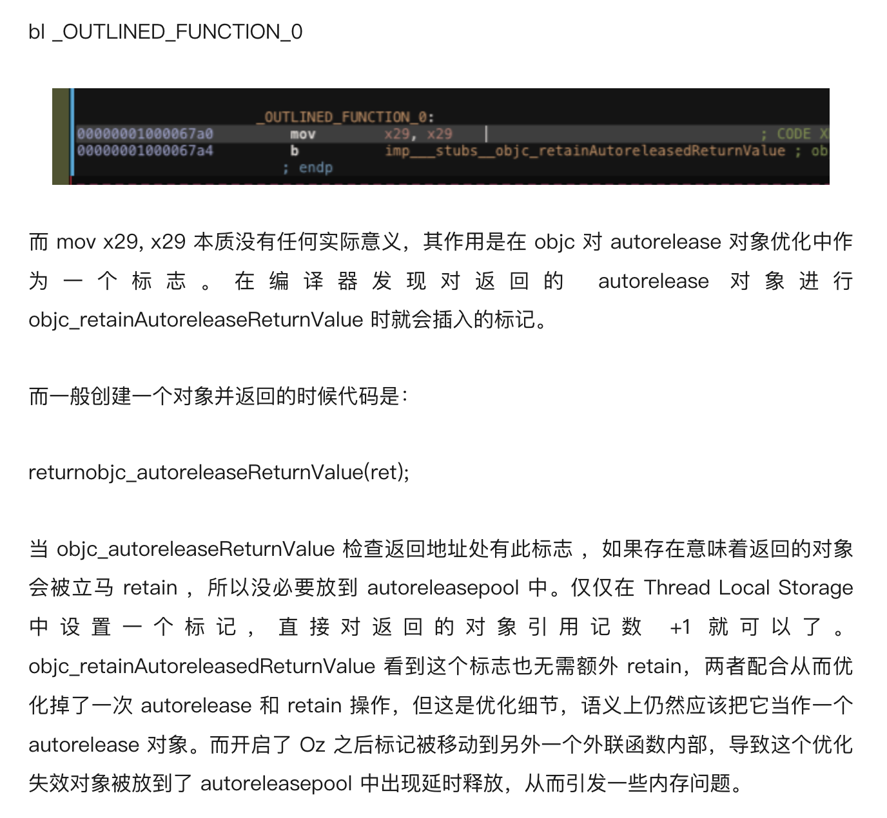

# 不同优化选项导致 dealloc 时机变化
2021-1-27

⼀周内遇到了的第⼆个只在 Release 版下才有的 bug：核心原因是 ARC 下的某个优化破坏了 autorelease 的语义，在 Oz 优化下反⽽恢复了“正常”，导致了 bug。

精简后的重现代码：

navigationController 管理着多个 ViewController 实例，当响应事件 onTapped 时，只保留顶端的实例，开发中是先⾛到 delloc，再⾛到 did pop，正好满⾜需求。

```objc
@implementation ViewController
- (void)dealloc {
    NSLog(@"%@ dealloc", self);
}

- (void)onTapped {
    self.navigationController.viewControllers = @[self.navigationController.viewControllers.lastObject];
    NSLog(@"did pop");
}
```

但在 Release build 中⾏为变了，是先⾛到 did pop，后⾛到 dealloc，时机被延后了，导致了⽤⼾可⻅的报错。

### 对⽐下两者的 call stack:

Debug 下⽴刻触发 dealloc

```
* thread #1, queue = 'com.apple.main-thread', stop reason = breakpoint 21.1
    frame #0: 0x0000000106a21c0c AwemeInhouse`-[AWERecorderViewController dealloc](self=0x0000000148798b90, _cmd="dealloc") at AWERecorderViewController.m:49:6
    frame #1: 0x00000001882179d8 CoreFoundation`-[__NSArrayI dealloc] + 76
    frame #2: 0x000000018a4015f4 UIKitCore`-[UINavigationController _setViewControllers_7_0:transition:animated:operation:] + 3048
    frame #3: 0x000000018a4006d8 UIKitCore`-[UINavigationController _setViewControllers:transition:animated:operation:] + 576
    frame #4: 0x000000018a3ff96c UIKitCore`__54-[UINavigationController setViewControllers:animated:]_block_invoke + 1156* 
    frame #5: 0x000000018a3ff4e4 UIKitCore`-[UINavigationController setViewControllers:animated:] + 688
    frame #6: 0x00000001048e8178 AwemeInhouse`-[AWEAwemeDetailTableViewController removeRecorderIn:](self=0x000000012f76fc00, _cmd="removeRecorderIn:", navigationController=0x0000000130388800) at AWEAwemeDetailTableViewController.m:6960:13
```

Release build 下却要等到 AutoreleasePool 来触发 dealloc

```
* thread #1, queue = 'com.apple.main-thread', stop reason = breakpoint 2.1
    * frame #0: 0x0000000101f1a678 AwemeInhouse`-[AWERecorderViewController dealloc](self=0x0000000161c09b70, _cmd="dealloc") at AWERecorderViewController.m:49:6[opt]
    frame #1: 0x00000001882179d8 CoreFoundation`-[__NSArrayI dealloc] + 76
    frame #2: 0x000000019bcfd574 libobjc.A.dylib`AutoreleasePoolPage::releaseUntil(objc_object**) + 200
    frame #3: 0x000000019bcfd450 libobjc.A.dylib`objc_autoreleasePoolPop + 208
    frame #4: 0x000000018ac35c78 UIKitCore`__processEventQueue + 6564
    frame #5: 0x000000018ac2cee0 UIKitCore`__eventFetcherSourceCallback + 156
    frame #6: 0x00000001882adbe0 CoreFoundation`__CFRUNLOOP_IS_CALLING_OUT_TO_A_SOURCE0_PERFORM_FUNCTION__ + 24
    frame #7: 0x00000001882adae0 CoreFoundation`__CFRunLoopDoSource0 + 204
    frame #8: 0x00000001882ace28 CoreFoundation`__CFRunLoopDoSources0 + 256
    frame #9: 0x00000001882a73d0 CoreFoundation`__CFRunLoopRun + 776
    frame #10: 0x00000001882a6b90 CoreFoundation`CFRunLoopRunSpecific + 572
    frame #11: 0x000000019e5c9598 GraphicsServices`GSEventRunModal + 160
    frame #12: 0x000000018ab90638 UIKitCore`-[UIApplication _run] + 1052
    frame #13: 0x000000018ab95bb8 UIKitCore`UIApplicationMain + 164
    frame #14: 0x000000010092af08 AwemeInhouse`main(argc=1, argv=0x000000016f7ff708) at main.m:59:16 [opt]
    frame #15: 0x0000000187f85588 libdyld.dylib`start + 4
```

### 修复方案：

用 autoreleasepool 包裹释放代码 ，使 delloc 时机提前

```objc
- (void)onTapped {
    @autoreleasepool {
        self.navigationController.viewControllers = @[self.navigationController.viewControllers.lastObject];
    }
    NSLog(@"did pop");
}
```

至此 bug 算排查完毕，但为什么呢？

### 对比编译产物：

Debug、Release 差异选项较多，再排查下去发现只有开启了 Oz，才有这种现象。开启 Ofast 都是正常的



开启 Oz 时 viewControllers 被加入了 AutoReleasePool

```c
void __fastcall -[ViewController onTapped](ViewController *const self, SEL _cmd){
    v2 = self;
    objc_msgSend(self, "navigationController");
    OUTLINED_FUNCTION_0();
    v4 = v3;objc_msgSend(v3, "viewControllers");
    OUTLINED_FUNCTION_0();
    objc_msgSend(v5, "lastObject");
    OUTLINED_FUNCTION_0();
    v7 = v6;
    v11 = v6;
    objc_msgSend(&OBJC_CLASS___NSArray, "arrayWithObjects:count:", &v11, 1LL, v6);
    OUTLINED_FUNCTION_0();
    v9 = v8;objc_msgSend(v2, "navigationController");
    OUTLINED_FUNCTION_0();
    objc_msgSend(v10, "setViewControllers:", v9);
    OUTLINED_FUNCTION_2();
    objc_release(v9);
    objc_release(v7);
    OUTLINED_FUNCTION_3();
    objc_release(v4);
    NSLog(CFSTR("did pop"));
    if ( __stack_chk_guard == v12 )
        OUTLINED_FUNCTION_1();
}
```

```
_OUTLINED_FUNCTION_0
MOV X29, X29
B _objc_retainAutoreleasedReturnValue

_OUTLINED_FUNCTION_2
MOV X0, X21
B _objc_release_

OUTLINED_FUNCTION_3
MOV X0, X20
B _objc_release
```

[iOS 安装包大小优化实践篇](https://www.sohu.com/a/446186091_208051) 大作有详尽的解释



这个内存问题凑巧导致了本次用戶可见的 bug。

不开启 Oz 时 viewControllers 被立刻释放

```c
void __cdecl -[ViewController onTapped](ViewController *const self, SEL _cmd){
    v2 = self;
    v3 = objc_msgSend(self, "navigationController");
    v4 = (void *)objc_retainAutoreleasedReturnValue(v3);
    v5 = v4;
    v6 = objc_msgSend(v4, "viewControllers");
    v7 = (void *)objc_retainAutoreleasedReturnValue(v6);
    v8 = v7;
    v9 = objc_msgSend(v7, "lastObject");
    v16 = objc_retainAutoreleasedReturnValue(v9);
    v10 = v16;
    v11 = objc_msgSend(&OBJC_CLASS___NSArray, "arrayWithObjects:count:", &v16, 1LL);
    v12 = objc_retainAutoreleasedReturnValue(v11);
    v13 = objc_msgSend(v2, "navigationController");
    v14 = (void *)objc_retainAutoreleasedReturnValue(v13);
    objc_msgSend(v14, "setViewControllers:", v12, v14);
    objc_release(v15);
    objc_release(v12);
    objc_release(v10);
    objc_release(v8);
    objc_release(v5);
    NSLog(CFSTR("did pop"));
}
```

对比下 Oz 版本少了对 viewControllers 调用 objc_release，导致其最后在 AutoreleasePool 中才释放。

|         | 开关 | 起到的作用         | 语义上                 |
| ------- | ---- | ------------------ | ---------------------- |
| Debug   | -O0  | 有优化，立刻释放   | 不符合 autorelase 语义 |
| Release | -Oz  | 优化失效，延后释放 | 符合 autorelase 语义   |

### 避免的方法
1. 开启 Oz 进行开发🐶
2. 或者，有明确依赖释放时机的话，主动使用 @autoreleasepool {} 进行管理，不要依赖默认行为。

- 完 -

