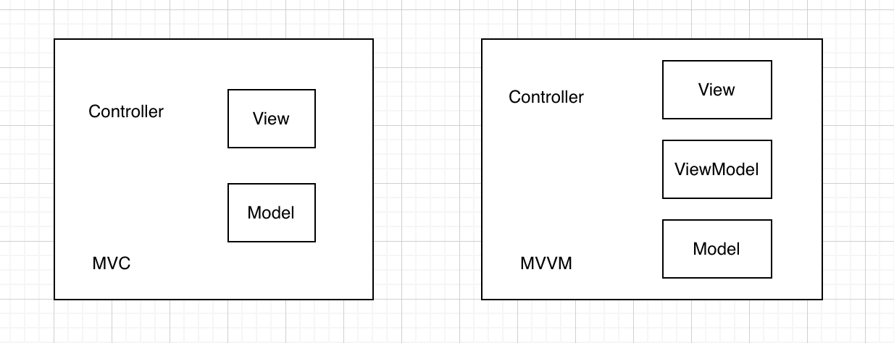
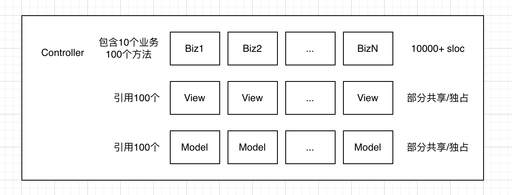
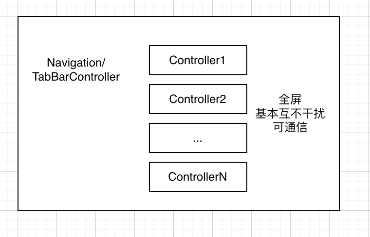
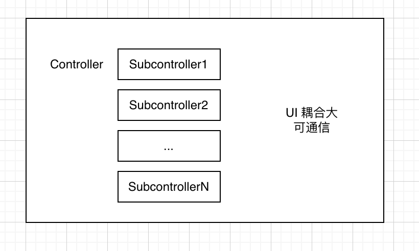
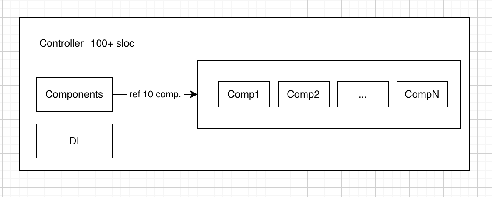
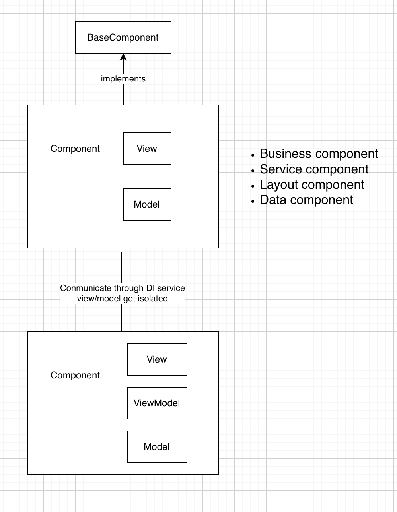

### 复杂业务架构 - 子模块拆分
2022-03-13

一般的业务模块设计往往采用 MVC 或 MVVM 等结构（不含底层服务模块）：

这些结构并没有谁最优秀之说，都有其适用场景，且大部分情况下都效果良好。但当业务增长过快，缺乏进一步设计时，往往会演化成如下的样子：

每个业务方有新增逻辑时，就往 VC 上添加需要的 view、model 与业务代码，这些业务代码也极有可能会修改已有的 view、model 等。由于对 VC 内部状态的高度耦合，这些业务代码不容易提取到外部，导致 VC 最终的体积极速膨胀，导致后续进一步的修改越来越困难、越来越容易出错。

复杂性的来源：

 * 提需求的人多（熵增）  
 * 做需求的人多（熵增） 
 * 前二者以“某种方式”分割成了不同的部门，又往往需要改同一个地方。他们思考的⻆度、期望达成的目标、可接受成本等不同导致了理想在现实中打架，最终酝酿出一个杂烩/集合体（平衡点） 
 * 这是个健康的正循环，但过程有痛点，不能扼杀提需求这个源头，但可以控制做需求的方式。

先参考一下 Apple 官方设计中是否有可以借鉴的

比如一个复杂的应用自然而然的以页面的维度进行了拆分，每个业务实现各自的 VC，再通过容器（Nav/Tab）组装起来即可。通信上也有 delegate/notification 等多种手段。每个页面基本占据整个屏幕，也是这种拆分比较容易实现的原因。

那由此推导，希望设计出如下的架构：

把一个复杂的 VC 按业务线拆为多个 subcontroller，每块业务负责一部分的 UI，所有 model、view 都隔离在不同 subcontroller 之中。互相通过接口协议通信，可以做局部的替换、演进而不干扰整体。需要解决的问题1：通信需求大大增加，delegate/notification 非常不便。2：UI 也有较高的耦合需要定制的协调者。细化一下之前的设计：

TopVC 只需要持有核心的 DI 容器，引用并派发生命周期到 n 个业务组件即可，基本控制在 100 行代码左右。所有业务逻辑拆分到组件中，其内部可进一步使用 MVC、MVVM 等都可以：

这些组件管理着自己的 view、model，通过 DI 容器访问其它组件提供的 service，做到了业务代码、view、model 的隔离。若一个组件再次增长过快，可以提取一个新的业务概念拆分出新的组件，保持每个小块的可维护性，减少相互的干扰。

小结一下：

核心思路：拆解 - 用合理的拆解匹配组织架构上的分割，达到“高内聚/低耦合”，减少相互干扰，提高质量。

 * 方法级别拆解 
 * 类级别拆解 
 * 模块级别拆解 
 * ...

举个例子比如系统很多地方默认设计是一对一的，实际使用前最好拆解为一对多。如 AppDelegate转发到 InitTask、UIViewController 生命周期转发到 Subcomponents。后续各业务方独占一个子Task 或 Component。其内部复杂度再到达一定层次，可继续提取一些逻辑概念，层层拆解。不局限于 iOS。

拆解的顺序：先垂直拆解（按逻辑/业务等概念），后水平拆解。

水平拆解指的是按某种特性，特别是技术上的、业务中立的特性：如数据层、网络层、表现层等等，在架构图的展示中往往以水平层叠的样式，故这么指代。常提的 MVC、MVP、MVVM 等等都是一种水平拆解。

垂直拆解以业务逻辑为边界，比如一个电商系统，它的一级拆解应该是账号、订单、商品、配送等等。每个模块明确边界后在实现上再以水平拆解推进：存储层、业务层、服务层、UI 层等等。一些重复建设问题应以 xx 中台、SDK 等形式共享，但不追求绝对意义的无冗余。合理的冗余是健康的。

水平拆分即分层架构，是运用最为广泛的架构模式之一，比如：
 * 用戶界面层 User Interface Layer
 * 业务逻辑层 Business Logic Layer
 * 数据访问层 Data Access Layer
 * 基础层 Infrastructure Layer

依赖的方向一般是上方依赖下方。

而垂直拆分一个常见的例子如电商系统拆分微服务：
* 用戶服务
* 商品服务
* 订单服务
* ...

可独立团队各自维护。每个模块有各自的 UI、独立的业务逻辑，隔离的数据存储等等，即有独立的内部架构。

拆分的⻆度
 * 水平 
 * 垂直

水平拆分即分层架构，在 iOS 领域一般有这些层级：
 * View Controller 
 * View 
 * Model / Data Controller 
 * Network / Storage (Infrastructure) 
 * ...

这种水平拆分更多地是基于层与层之间性质上的不同，它们之间的依赖一般有推荐的方向。

而垂直拆分在 iOS 领域一般按页面进行拆分如
 * 视频播放页 
 * 个人主页 
 * 拍摄页 
 * ...

这种颗粒度对于小型项目足以够用。但无法驾驭复杂项目，如一些重构前的超大 VC 数万行代码，大量团队同时有改动的需求，上手困难还互相影响，属于负面例子。

故此处主要讨论更小级别的垂直拆分（如子 VC、子方法级别），目的还是低耦合高内聚，可承载不同团队同时迭代开发。

子模块拆分是一种垂直拆分
 * 子 VC 级别
   * Element
   * Feature Component
 * 子方法级别
   * Flow Action
   * Boot Task
 * 示例
   * 云相册
   * 密友拍摄
   * 转发聚合

#### (完)

### 附录案例
### Element
容器：交互区 PlayInteractionViewController

生命周期派发：PlayInteractionDispatcherManager

通信 Context
 * 注册 self.context addKey:handler: 
 * 调用 self.context postForKey:

子模块（垂直拆分）
 * 基类：PlayInteractionBaseElement
   * PlayInteractionLeftElement
   * PlayInteractionRightElement
   * PlayInteractionBottomElement
 * XxxElement XxxView XxxViewModel 
 * 130 多个

### Feature Component
容器：编辑页 StudioVideoEditViewController

生命周期派发：ComponentManager

通信：基于 IESInject（简单理解是拿 protocol 作为 key，存取相应对象）
 * 注册 IESProvidesSingleton(ACCCameraService) 
 * 获取 IESAutoInject(self.serviceProvider, cameraService, ACCCameraService)

子模块（垂直拆分）
 * 基类：FeatureComponent 
 * XxxComponent XxxView XxxViewModel 
 * ~40个

方法级别拆分
### Flow Action
容器：-[VideoPublishFooterViewController p_publishButtonClicked]

调度者：VideoPublishFlowService

子模块
 * 基类：LightPromise 
 * PublishEndEdit 
 * PublishButtonClickedAlert 
 * PublishFlowNet 
 * PublishFlowLogin 
 * PUblishFlowYouth 
 * PublishFlowABCheck 
 * PublishFlowTitle 
 * NotifyPublishButtonClicked
 * PublishSetItemDownaldAllPeople 
 * PublishReqeustAlubmPermission 
 * PublishRemovePreFlow 
 * PublishCover 
 * 约30个

方式：拆分为 Promise 对象，各自独立 class 实现

### Boot Task
容器：-[HTSBootAppDelegate application:didFinishLaunchingWithOptions:]

调度者：HTSBootLoader

子模块：
 * 基类：HTSBootTask 
 * PremainDelayInitTask 
 * LanguageInitTask 
 * APMInitTask 
 * BigFontServiceInitTask 
 * CrashInitTask 
 * ImageInitTask 
 * XBridgeKitBootTask 
 * OpenShareInitTask 
 * StudioInitTask 
 * DownloadActivityWatermarkTask 
 * ECommerceBootTask 
 * 约60多个

方式：拆分为 BootTask 对象，各自独立 class 实现

方法级别拆分比 view controller 拆分少一个问题：即生命周期的派发。

### 小结
可以使用这一思想 - 即 subcontroller 级别的垂直拆分，垂直是指每个子模块可包含原 VC、View、Model 各层的业务，类似于播放器与个人主页是两个独立业务，**同一个页面内拍摄按钮与闪光灯也可以是独立的。**

而为了达成这一个目的，合适情况下可使用现有框架，也可以不使用，因为核心代码极少。理解本质即可：将业务逻辑拆分到不同的 class 中。（class 可以独立文件，objc 虽然有 category 可以将方法独立成文件，但实际隔离性很差，不合适此场景）

### 示例1
容器：云相册 CloudAlbumDetailViewController

生命周期派发：CloudAlbumDetailComponentManager

通信：基于 IESInject子模块（垂直拆分）
 * 基类：CloudAlbumDetailBaseComponent 
 * 7个 CloudAlbumDetailXxxComponent 
 * 导航栏、数据、列表、底Bar、下载、发布等

### 示例2
容器：密友拍摄页 AFDMomentCameraViewController

生命周期派发：AFDMomentCameraViewController 自己

通信：通过 AFDMomentCameraViewModelFactory 传递 ViewModel & 共享一些 Service

子模块（垂直拆分）
 * 基类：AFDMomentCameraBaseComponent / AFDMomentCameraBaseViewModel 
 * 10个 AFDMomentCameraXxxComponent / AFDMomentCameraXxxViewModel 
 * 翻转、拍摄、下载、缩放、发布等

### 示例3
容器：转发作品聚合页 SharedPostsViewController

生命周期派发：SharedPostsViewController 自己

通信：基于 <del>IESInject</del> SimpleContainer子模块（垂直拆分）
 * 基类：SharedPostsComponent 
 * 多个 SharedPostsXxxComponent 
 * 数据加载、列表等，删除作品暂不需要
