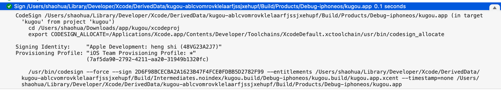
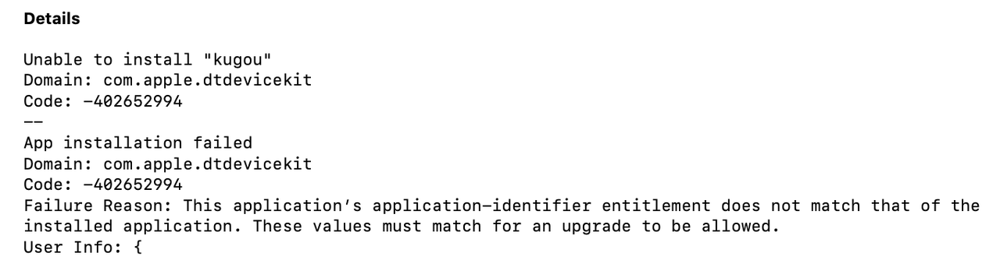
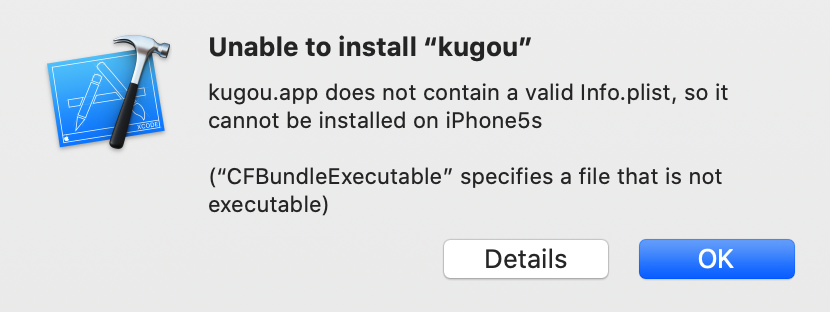

# Xcode 无源码调试第三方 app
2020-4-8

## 一、脱壳
步骤省略，可参考第三方如：[iOS应用脱壳(解密)的几种方式](https://www.jianshu.com/p/2d38f036990d)

输出是一个解密后的 ipa 文件，确认方法：

```
otool -l kugou | grep crypt
cryptid 0
```


## 二、静态分析过程
进行 Charles 抓包，获得到感兴趣的 API 名称 `get_collect_user_list`

```
// 字符串表内查找引用其的函数
0000000104b1e9dd         db         "listen.cloudlistmodule.url.get_collect_user_list", 0 ; DATA XREF=cfstring_listen_cloudlistmodule_url_get_collect_user_list

0000000103bc90a8         dq         0x00000001061188b8, 0x00000000000007c8, 0x0000000104b1e9dd, 0x0000000000000030 ; "listen.cloudlistmodule.url.get_collect_user_list", DATA XREF=-[CloudPlayListHttpDao getAllCollecterListWithCloudList:AndUserId:AndPage:AndPageSize:AndToken:AndError:]+980

// 发现目标函数
-[CloudPlayListHttpDao getAllCollecterListWithCloudList:AndUserId:AndPage:AndPageSize:AndToken:AndError:]
```

使用 IDA 或 Hopper 对该函数反编译
```c
/* @class CloudPlayListHttpDao */
-(void *)getAllCollecterListWithCloudList:(void *)arg2 AndUserId:(long long)arg3 AndPage:(long long)arg4 AndPageSize:(long long)arg5 AndToken:(void *)arg6 AndError:(void * *)arg7 {
    r31 = r31 - 0x1f0;
    var_50 = r28;
    stack[-88] = r27;
    var_40 = r26;
    stack[-72] = r25;
    var_30 = r24;
    stack[-56] = r23;
    var_20 = r22;
    stack[-40] = r21;
    var_10 = r20;
    stack[-24] = r19;
    saved_fp = r29;
    stack[-8] = r30;
    var_190 = arg7;
    var_180 = arg4;
    var_178 = arg5;
    var_170 = arg3;
    var_158 = self;
    r26 = [arg2 retain];
    var_160 = [arg6 retain];
    r22 = [[NSDictionary dictionaryWithObject:@"CloudPlayList" forKey:@"UserAgent"] retain];
    var_168 = [objc_alloc() init];
    r23 = [[NSMutableDictionary dictionary] retain];
    r24 = [[CloudPlayListAES cloudPlayListAES] retain];
    r28 = [r26 source];
    r21 = [r26 oid];
    r27 = [r26 orid];
    r0 = [r26 globalId];
    r29 = &saved_fp;
    r25 = [r0 retain];
    r20 = objc_msgSend(@class(StringTool), @selector(isEmptyStr:));
    [r25 release];
    var_188 = r26;
    if ((r20 & 0x1) == 0x0) {
            var_1A8 = r24;
            var_198 = r23;
            r23 = r22;
            r0 = [r26 globalId];
            r0 = [r0 retain];
            r25 = [[r0 componentsSeparatedByString:@"_"] retain];
            [r0 release];
            r0 = [r25 numberAtIndexKGSafe:0x1];
            r29 = r29;
            r0 = [r0 retain];
            r24 = [r0 integerValue];
            [r0 release];
            if (r24 == 0x1) {
                    if (!CPU_FLAGS & E) {
                            r28 = r28;
                    }
                    else {
                            r28 = 0x3;
                    }
            }
            if (r28 == 0x3) {
                    r0 = [r25 numberAtIndexKGSafe:0x3];
                    r29 = r29;
                    r0 = [r0 retain];
                    r27 = [r0 integerValue];
                    [r0 release];
                    r21 = 0x0;
            }
            [r25 release];
            r22 = r23;
            r23 = var_198;
            r24 = var_1A8;
    }
    r19 = [[NSNumber numberWithUnsignedInt:r28] retain];
    [r23 setObject:r19 forKey:@"source"];
    [r19 release];
    r20 = [[NSNumber numberWithLongLong:r21] retain];
    [r23 setObject:r20 forKey:@"list_create_userid"];
    [r20 release];
    r19 = [[NSNumber numberWithLongLong:r27] retain];
    [r23 setObject:r19 forKey:@"list_create_listid"];
    [r19 release];
    r19 = [[NSNumber numberWithInteger:var_180] retain];
    [r23 setObject:r19 forKey:@"page"];
    [r19 release];
    r19 = [[NSNumber numberWithInteger:var_178] retain];
    [r23 setObject:r19 forKey:@"pagesize"];
    [r19 release];
    r28 = [[r23 JSONString2] retain];
    r25 = var_168;
    [r25 setUrlKey:@"listen.cloudlistmodule.url.get_collect_user_list"];
    r20 = [[NSString stringWithFormat:@"%d"] retain];
    r21 = [[var_158 createInitDicWithUserID:r20 AndToken:var_160 AndAes:r24] retain];
    r19 = [[NSString stringWithFormat:@"?%@"] retain];
    [r25 setFillUrl:r19];
    [r19 release];
    [r21 release];
    [r20 release];
    [r25 setReturnDataType:0x4];
    [r25 setHeader:r22];
    [r25 setAskWithOnlyWifi:0x0];
    r21 = [[r24 key] retain];
    r0 = [r24 iv];
    r0 = [r0 retain];
    r20 = r24;
    r24 = r22;
    r26 = r28;
    r19 = [[NSData dataWithEncryptStr:r28 AndKey:r21 AndIv:r0] retain];
    [r25 setPostBody:r19];
    [r19 release];
    [r0 release];
    [r21 release];
    r0 = [var_158 doPostWithPostMethodInfo:r25 AndError:&var_108];
    r29 = r29;
    r19 = [r0 retain];
    r0 = [var_108 retain];
    r22 = r0;
    if (r0 == 0x0) goto loc_100e03c18;

loc_100e03be0:
    [r19 release];
    [r26 release];
    [r20 release];
    [r23 release];
    [r25 release];
    [r24 release];
    r20 = var_188;
    r21 = 0x0;
    r19 = var_190;
    if (r19 != 0x0) {
            r21 = 0x0;
            if (r22 != 0x0) {
                    r0 = objc_retainAutorelease(r22);
                    r22 = r0;
                    r21 = 0x0;
                    *r19 = r0;
            }
    }
    goto loc_100e04234;

loc_100e04234:
    var_60 = **___stack_chk_guard;
    [r22 release];
    [var_160 release];
    [r20 release];
    if (**___stack_chk_guard == var_60) {
            r0 = [r21 autorelease];
    }
    else {
            r0 = __stack_chk_fail();
    }
    return r0;

loc_100e03c18:
    var_1A0 = r19;
    var_198 = r23;
    var_1B8 = r26;
    var_1B0 = r24;
    r26 = [objc_msgSend(@class(NSString), @selector(stringWithFormat:)) retain];
    r23 = [objc_msgSend(@class(NSString), @selector(stringWithFormat:)) retain];
    r24 = [[NSMutableDictionary dictionaryWithCapacity:0x5] retain];
    r19 = [objc_msgSend(@class(NSNumber), @selector(numberWithInteger:)) retain];
    [r24 setObjectKGSafe:r19 forKey:**_FaultToleranceTypeKey];
    [r19 release];
    r21 = [r26 copy];
    [r24 setObjectKGSafe:r21 forKey:**_FaultToleranceCrashFunctionKey];
    [r21 release];
    var_178 = r23;
    r19 = [r23 copy];
    var_180 = r24;
    [r24 setObjectKGSafe:r19 forKey:**_FaultToleranceCrashLineKey];
    [r19 release];
    r24 = r20;
    r21 = [objc_msgSend(r20, @selector(key)) retain];
    r19 = [[r24 iv] retain];
    r20 = [[var_1A0 AES128DecryptToDateWithKey:r21 andIv:r19] retain];
    [r19 release];
    [r21 release];
    var_1C0 = r20;
    r23 = var_198;
    r0 = [NSDictionary dictionaryWithJSONData:r20 error:&var_110];
    r27 = var_158;
    r29 = r29;
    r19 = [r0 retain];
    r28 = [var_110 retain];
    [r22 release];
    var_170 = r19;
    if (r28 == 0x0) goto loc_100e03e34;

loc_100e03e28:
    r22 = r28;
    goto loc_100e0419c;

loc_100e0419c:
    r19 = 0x2;
    r20 = var_188;
    goto loc_100e041a0;

loc_100e041a0:
    [var_170 release];
    [var_1C0 release];
    [var_180 release];
    [var_178 release];
    [r26 release];
    [var_1A0 release];
    [var_1B8 release];
    [r24 release];
    [r23 release];
    [var_168 release];
    [var_1B0 release];
    if ((r19 | 0x2) == 0x2) {
            r21 = 0x0;
            r19 = var_190;
            if (r19 != 0x0) {
                    r21 = 0x0;
                    if (r22 != 0x0) {
                            r0 = objc_retainAutorelease(r22);
                            r22 = r0;
                            r21 = 0x0;
                            *r19 = r0;
                    }
            }
    }
    goto loc_100e04234;

loc_100e03e34:
    r0 = [r19 kg_numberForKey:@"status"];
    r29 = r29;
    r0 = [r0 retain];
    r21 = @selector(integerValue);
    r22 = objc_msgSend(r0, r21);
    [r0 release];
    if (r22 != 0x1) goto loc_100e04038;

loc_100e03e80:
    r0 = objc_msgSend(var_170, @selector(dictionaryForKeyKGSafe:));
    r29 = r29;
    r0 = [r0 retain];
    [r0 release];
    if (r0 == 0x0) goto loc_100e04110;

loc_100e03eac:
    var_1A8 = r24;
    var_1D0 = r26;
    r19 = [[var_170 kg_dictionaryForKey:@"data"] retain];
    r21 = [[NSMutableArray array] retain];
    r0 = [r19 kg_arrayForKey:@"info"];
    var_1D8 = r19;
    r29 = r29;
    r0 = [r0 retain];
    var_140 = q0;
    r0 = [r0 retain];
    r22 = r0;
    r1 = @selector(countByEnumeratingWithState:objects:count:);
    var_158 = r1;
    r0 = objc_msgSend(r0, r1);
    r25 = r0;
    if (r0 != 0x0) {
            r24 = *var_140;
            do {
                    r26 = 0x0;
                    do {
                            if (*var_140 != r24) {
                                    objc_enumerationMutation(r22);
                            }
                            r20 = *(var_148 + r26 * 0x8);
                            objc_autoreleasePoolPush();
                            r0 = @class(CollecterInfoEntity);
                            r0 = [r0 yy_modelWithDictionary:r20];
                            r29 = r29;
                            [r0 retain];
                            objc_msgSend(r21, @selector(addObjectKGSafe:));
                            [r20 release];
                            objc_autoreleasePoolPop(r19);
                            r26 = r26 + 0x1;
                    } while (r26 < r25);
                    r0 = objc_msgSend(r22, var_158);
                    r25 = r0;
            } while (r0 != 0x0);
    }
    [r22 release];
    [r22 release];
    [var_1D8 release];
    r22 = 0x0;
    r19 = 0x1;
    r20 = var_188;
    r23 = var_198;
    r24 = var_1A8;
    r26 = var_1D0;
    goto loc_100e041a0;

loc_100e04110:
    r20 = [[NSDictionary dictionaryWithObjects:r29 - 0xe8 forKeys:&var_F0 count:0x1] retain];
    r22 = [objc_msgSend(@class(NSError), @selector(errorWithDomain:code:userInfo:)) retain];
    [r28 release];
    r0 = r20;
    goto loc_100e04194;

loc_100e04194:
    [r0 release];
    goto loc_100e0419c;

loc_100e04038:
    r21 = @selector(integerValue);
    r0 = [var_170 kg_numberForKey:@"error_code"];
    r0 = [r0 retain];
    r20 = objc_msgSend(r0, r21);
    [r0 release];
    r21 = [[r27 errorCodeToMsg:r20] retain];
    r25 = [[NSDictionary dictionaryWithObjects:&stack[-264] forKeys:&var_100 count:0x1] retain];
    r22 = [objc_msgSend(@class(NSError), @selector(errorWithDomain:code:userInfo:)) retain];
    [r28 release];
    [r25 release];
    r0 = r21;
    goto loc_100e04194;
}
```

发现疑似加密相关的方法
```
+[CloudPlayListAES cloudPlayListAES]
-[CloudPlayListHttpDao createInitDicWithUserID:AndToken:AndAes:]
+[NSData dataWithEncryptStr:AndKey:AndIv:]
-[NSData AES128DecryptToDateWithKey:andIv:]
```

## 三、动态分析过程
1. 新建一个相同 bundle id 与可执行文件名（CFBundleIdentifier & CFBundleExecutable）的工程，编译&运行
2. 替换为待调试 app
3. 重新签名 & 其它改动（Frameworks/PlugIns & restore symbol）
4. Xcode ➜ Product ➜ Perform Action ➜ Run Without Building (Attach to Process)
5. 设断点，开始分析

重新签名

Xcode ➜ Log ➜ Build ➜ Sign …/kugou.app 0.1 seconds



```
codesign ... kugou.app
codesign ... kugou.app/Frameworks/*
codesign ... kugou.app/PlugIns/*
```

### 问题1、报错不匹配的 bundle id


解决办法：删除原始应用

### 问题2、报错无效 Info.plist


原因：脱壳工具未正确设置可执行权限

```
> ls -l kugou
-rw-rw-r--  1 shaohua  staff  89566768 Apr  6 22:26 kugou
```

解决办法：
```
> chmod +x kugou
> ls -l kugou      
-rwxrwxr-x  1 shaohua  staff  89566768 Apr  6 22:26 kugou
```

### 问题3、断点无效

(lldb) br list

Current breakpoints:

1: name = '-[CloudPlayListHttpDao getAllCollecterListWithCloudList:AndUserId:AndPage:AndPageSize:AndToken:AndError:]', locations = 0 (pending)

pending 意味着符号无法解析到地址

解决办法：[restore-symbol](https://github.com/tobefuturer/restore-symbol) kugou

```
(lldb) br list
Current breakpoints:
1: name = '-[CloudPlayListHttpDao getAllCollecterListWithCloudList:AndUserId:AndPage:AndPageSize:AndToken:AndError:]', locations = 1, resolved = 1, hit count = 0

  1.1: where = kugou`-[CloudPlayListHttpDao getAllCollecterListWithCloudList:AndUserId:AndPage:AndPageSize:AndToken:AndError:], address = 0x000000010114b630, resolved, hit count = 0 

(lldb) image list kugou
[  0] 86B2CE1F-7256-3430-8470-4C2D800FD016 0x0000000100348000 /Users/shaohua/Library/Developer/Xcode/DerivedData/kugou-bybxznuhnjadvhasldvkiwxctnyq/Build/Products/Debug-iphoneos/kugou.app/kugou
```

反编译地址 + 随机偏移 = 目前内存中的实际地址

100E03630 + 348000 = 10114b630


### 正式开始分析
```
// 断点
-[CloudPlayListHttpDao getAllCollecterListWithCloudList:AndUserId:AndPage:AndPageSize:AndToken:AndError:]
```


```
// 断点
+[CloudPlayListAES cloudPlayListAES]
-[NSMutableDictionary JSONString2]
-[CloudPlayListHttpDao createInitDicWithUserID:AndToken:AndAes:]
+[NSData dataWithEncryptStr:AndKey:AndIv:]
-[NSData AES128DecryptToDateWithKey:andIv:]
```

```
// 单步调试
+[CloudPlayListAES cloudPlayListAES]
    -[CloudPlayListAES calculateAes]
    1586225284
    md5(225284) = 7c631ee0984c5ce6f8982b287e30da47
    aesStr=225284  key=7c631ee0984c5ce6  iv=f8982b287e30da47  
```

```
-[NSMutableDictionary JSONString2]

{"page":1,"pagesize":30,"source":1,"list_create_userid":1613803315,"list_create_listid":22}

-[CloudPlayListHttpDao createInitDicWithUserID:AndToken:AndAes:]
尾部
```

反编译 createInitDicWithUserID
```c
/* @class CloudPlayListHttpDao */
-(void *)createInitDicWithUserID:(void *)arg2 AndToken:(void *)arg3 AndAes:(void *)arg4 {
    r31 = r31 - 0xf0;
    var_50 = r28;
    stack[-88] = r27;
    var_40 = r26;
    stack[-72] = r25;
    var_30 = r24;
    stack[-56] = r23;
    var_20 = r22;
    stack[-40] = r21;
    var_10 = r20;
    stack[-24] = r19;
    saved_fp = r29;
    stack[-8] = r30;
    r24 = [arg2 retain];
    r20 = [arg3 retain];
    r22 = [arg4 retain];
    r0 = [NSDate date];
    r29 = &saved_fp;
    r0 = [r0 retain];
    r19 = r0;
    [r0 timeIntervalSince1970];
    asm { fcvtzs     x25, d0 };
    [r19 release];
    r21 = [[StatisticInfo appVersion] retain];
    var_98 = [[StatisticInfo udid] retain];
    r0 = @class(KGConfigEntity);
    r0 = [r0 instance];
    r0 = [r0 retain];
    r26 = [[r0 appKey] retain];
    [r0 release];
    r0 = @class(KGConfigEntity);
    r0 = [r0 instance];
    r0 = [r0 retain];
    r28 = [[r0 appID] retain];
    [r0 release];
    var_90 = r21;
    var_A8 = r26;
    var_A0 = r25;
    r25 = r28;
    r0 = [NSString stringWithFormat:@"%@%@%@%ld"];
    r0 = [r0 retain];
    r19 = r0;
    r0 = [r0 MD5];
    r0 = [r0 retain];
    r21 = r0;
    r0 = [r0 lowercaseString];
    r29 = r29;
    var_B0 = [r0 retain];
    [r19 release];
    [r21 release];
    if (r20 == 0x0) {
            [@"" retain];
            [r20 release];
            r20 = @"";
    }
    var_58 = **___stack_chk_guard;
    r27 = @selector(instance);
    r23 = &@class(FXBaseHttpDao);
    var_C0 = r20;
    r0 = [r22 aesStr];
    r19 = [r0 retain];
    asm { ins        v0.d[1], x8 };
    r28 = [[NSDictionary dictionaryWithObjects:&var_70 forKeys:&var_88 count:0x3] retain];
    [r19 release];
    r19 = [objc_alloc() init];
    r0 = *(r23 + 0x820);
    r0 = objc_msgSend(r0, r27);
    r0 = [r0 retain];
    r27 = r0;
    r23 = [[r0 appPublicKey] retain];
    r0 = [r28 JSONString2];
    r0 = [r0 retain];
    r21 = [[r19 rsaPublicKey:r23 AndContent:r0] retain];
    [r0 release];
    [r23 release];
    [r27 release];
    r0 = [NSMutableString string];
    r0 = [r0 retain];
    r27 = r0;
    [r0 appendFormat:@"appid=%@"];
    [r27 appendFormat:@"&clientver=%@"];
    [r27 appendFormat:@"&mid=%@"];
    [r27 appendFormat:@"&clienttime=%ld"];
    [r27 appendFormat:@"&key=%@"];
    [r27 appendFormat:@"&p=%@"];
    [r21 release];
    [r19 release];
    [r28 release];
    [var_B0 release];
    [r25 release];
    [var_A8 release];
    [var_98 release];
    [var_90 release];
    [r22 release];
    [var_C0 release];
    [r24 release];
    if (**___stack_chk_guard == var_58) {
            r0 = [r27 autorelease];
    }
    else {
            r0 = __stack_chk_fail();
    }
    return r0;
}


```

解读核心算法

```
date: 1586226565
appVersion: 10110
udid: c557dbc5dbe6feb9a61b47c353ea153c6fb7c837
appKey: y9tjae~n)k)vn[8
appID: 1000

1000y9tjae~n)k)vn[8101101586226565
s = appID + appKey + appVersion + date

md5(s) = 37ddc987c33360ddfc11848e87b08aac

{
    aes = 225284;
    token = "";
    uid = 0;
}

-----BEGIN PUBLIC KEY-----
MIGfMA0GCSqGSIb3DQEBAQUAA4GNADCBiQKBgQDcH4pzH4irCeUrL4OatRFWjBS2
ZmvB4ZpAnk4Zsq8um+wGOOBOM8H0gHYlpp8qbdE3tXPY8TKciMlKbjhh/sdNUaxj
sIQMY+ydOp2/Yt+h56euD6SVi0QT9OuTJTtOuX0oJhJGZVdWMVXvqWevO1+TuhRm
Z2Vu6GFzAR7KuZOkjwIDAQAB
-----END PUBLIC KEY-----

{"aes":"225284","uid":"0","token":""}

-[KGPlayListRSA rsaPublicKey:AndContent:]

62C120F7A02A9316BEDCAAF60C5D3CA2474EE18CC27C21E69935C316CFF7D60FBDE9930B74D144CA4FE24A1C26B02D8691377F6E05E23BCAC5CAAC5B193E111CEEDE5E4D1E7E8E145A3585640B9B9806C1BBA1C571104176D76E74B8B208BBEC9C1BFAF111B2582E734C491C0881878025E10AA733B76FB21606801BACDCD5DD

返回
appid=1000&clientver=10110&mid=c557dbc5dbe6feb9a61b47c353ea153c6fb7c837&clienttime=1586226565&key=37ddc987c33360ddfc11848e87b08aac&p=62C120F7A02A9316BEDCAAF60C5D3CA2474EE18CC27C21E69935C316CFF7D60FBDE9930B74D144CA4FE24A1C26B02D8691377F6E05E23BCAC5CAAC5B193E111CEEDE5E4D1E7E8E145A3585640B9B9806C1BBA1C571104176D76E74B8B208BBEC9C1BFAF111B2582E734C491C0881878025E10AA733B76FB21606801BACDCD5DD
```

快速验证
https://www.devglan.com/online-tools/aes-encryption-decryption

## 四、算法小结
* AES 对称加密 request/response body
* 取当前时间 ➜ 1586225284
* 从下标4开始 ➜ 225284
* 求 md5 ➜ 7c631ee0984c5ce6 f8982b287e30da47
* 前 16 个 ➜ 7c631ee0984c5ce6 作为 key
* 后 16 个 ➜ f8982b287e30da47 作为 iv

* 模式为 AES-CBC-128
* aesStr=225284  key=7c631ee0984c5ce6  iv=f8982b287e30da47

其它参数
1. appid=1000

   固定值
2. clientver=10110

   固定值
3. mid=c557dbc5dbe6feb9a61b47c353ea153c6fb7c837

   设备 udid，可随机生成
4. clienttime=1586226565

   设备时间，需根据真实变化
5. key=37ddc987c33360ddfc11848e87b08aac

   ("1000" + "y9tjae~n)k)vn[8" + "10110" + "1586226565").md5()
   (appid + 固定 secret + clientver + clienttime).md5()
6. p= 62C120F7A02A9316BEDCAAF60C5D3CA2474EE18CC27C21E69935C316CFF7D60FBDE9930B74D144CA4FE24A1C26B02D8691377F6E05E23BCAC5CAAC5B193E111CEEDE5E4D1E7E8E145A3585640B9B9806C1BBA1C571104176D76E74B8B208BBEC9C1BFAF111B2582E734C491C0881878025E10AA733B76FB21606801BACDCD5DD

参数 p 使用了非对称加密，公钥为

    -----BEGIN PUBLIC KEY-----
    MIGfMA0GCSqGSIb3DQEBAQUAA4GNADCBiQKBgQDcH4pzH4irCeUrL4OatRFWjBS2
    ZmvB4ZpAnk4Zsq8um+wGOOBOM8H0gHYlpp8qbdE3tXPY8TKciMlKbjhh/sdNUaxj
    sIQMY+ydOp2/Yt+h56euD6SVi0QT9OuTJTtOuX0oJhJGZVdWMVXvqWevO1+TuhRm
    Z2Vu6GFzAR7KuZOkjwIDAQAB
    -----END PUBLIC KEY-----

输入为上面的 aesStr，经测试发现加密模式是 PKCS#1 v1.5

{"aes":"225284","uid":"0","token":""}

简单评价

## 五、算法利用
### 方法1. 重新实现
```py
#! /usr/bin/env python3

# pip3 install PyCrypto

import requests
import json

from time import time
from hashlib import md5
from Crypto.Cipher import AES
from base64 import b64encode, b64decode
from binascii import hexlify, unhexlify
from Crypto.PublicKey import RSA
from Crypto.Cipher import PKCS1_v1_5
from pprint import pprint

appid = '1000'
clientver = '10110'
secret = 'y9tjae~n)k)vn[8'
t = str(int(time()))

concat = appid + secret + clientver + t
key = md5(concat.encode('utf-8')).hexdigest()

# 参数 p 是 rsa 加密
aeskey = t[4:]
p = '{"aes":%s,"uid":"0","token":""}' % aeskey

pubkey = 'MIGfMA0GCSqGSIb3DQEBAQUAA4GNADCBiQKBgQDcH4pzH4irCeUrL4OatRFWjBS2ZmvB4ZpAnk4Zsq8um+wGOOBOM8H0gHYlpp8qbdE3tXPY8TKciMlKbjhh/sdNUaxjsIQMY+ydOp2/Yt+h56euD6SVi0QT9OuTJTtOuX0oJhJGZVdWMVXvqWevO1+TuhRmZ2Vu6GFzAR7KuZOkjwIDAQAB'
keyDER = b64decode(pubkey)
keyPub = RSA.importKey(keyDER)
rsaCipher = PKCS1_v1_5.new(keyPub)
encP = hexlify(rsaCipher.encrypt(p.encode('utf-8'))).decode('utf-8').upper()

params = {
    'appid': appid,
    'clientver': clientver,
    'mid': 'c557dbc5dbe6feb9a61b47c353ea153c6fb7c837',
    'clienttime': t,
    'key': key,
    'p': encP
}

# pprint(params)
url = 'http://cloudlist.service.kugou.com/v1/get_collect_user_list'

headers = {
    'user-agent': 'iOS12.4-Phone10110-1009-0-WiFi',
    'x-router': 'cloudlist.service.kugou.com',
    'KG-THash': '000000010169afdc',
    'dfid': '1093UM0Dv0vS44q27z1gLCNx',
    'Content-Type': 'application/x-www-form-urlencoded',
    'KG-RC': '1',
}

# body 是 aes 加密
kiv = md5(aeskey.encode('utf-8')).hexdigest()
k = kiv[:16]
iv = kiv[16:]
aesCipher = AES.new(k, AES.MODE_CBC, iv)

body = '{"page":1,"pagesize":30,"source":1,"list_create_userid":1299762392,"list_create_listid":46}'
payload = body.encode('utf-8')
padding = 16 - (len(payload) % 16)
payload += bytes([padding]) * padding
encBody = aesCipher.encrypt(payload)
# print(hexlify(encBody))

# 开始请求
r = requests.post(url, headers=headers, params=params, data=encBody)
aesCipher = AES.new(k, AES.MODE_CBC, iv) # 注意此处要 renew，否则影响结果
o = aesCipher.decrypt(r.content)
padding = o[-1]
if padding < 16:
    o = o[:-padding]
# with open('out.bin', 'wb') as fp:
#     fp.write(o)
b = o.decode('utf-8')
txt = json.loads(b)
pprint(txt)
```

### 方法2. 注入 dylib

参考: [iOS逆向工具09-yololib注入framework](https://www.jianshu.com/p/0e80958eb1d8)

在运行原 app 的同时，额外开启了网络服务，提供签名等服务。

Xcode ➜ File ➜ New ➜ Project... ➜ iOS Framework

```objc
// 服务端
+ (void)load {
    GCDWebServer *server = [[GCDWebServer alloc] init];
    [server addHandlerForMethod:path:requestClass:processBlock:^{
        调用加密函数并构造 HTTP 返回
    }];
    [server startWithPort:4000 bonjourName:nil];
}

// 客户端
resp = requests.post('http://10.9.30.25:4000/enc', data=payload.encode('utf-8'))
sign = resp.text
```

### 方法3. 变为 dylib
参考: [黑科技：把第三方 iOS 应用转成动态库](http://blog.imjun.net/posts/convert-iOS-app-to-dynamic-library/)

直接用基地址+偏移 获得函数的地址，强制转换后再调用。若关键函数本身就在 Framework 中都可以省去这一步。

```c
static void *find_dyld(void) {
    // Get DYLD task infos
    struct task_dyld_info dyld_info;
    mach_msg_type_number_t count = TASK_DYLD_INFO_COUNT;
    kern_return_t ret;
    ret = task_info(mach_task_self_,
                    TASK_DYLD_INFO,
                    (task_info_t)&dyld_info,
                    &count);
    if (ret != KERN_SUCCESS) {
        return NULL;
    }

    // Get image array's size and address
    mach_vm_address_t image_infos = dyld_info.all_image_info_addr;
    struct dyld_all_image_infos *infos;
    infos = (struct dyld_all_image_infos *)image_infos;
    uint32_t image_count = infos->infoArrayCount;
    struct dyld_image_info *image_array = infos->infoArray;

    // Find libsystem_c.dylib among them
    struct dyld_image_info *image;
    for (int i = 0; i < image_count; ++i) {
        image = image_array + i;

        // Find libsystem_c.dylib's load address
        if (strstr(image->imageFilePath, "Foo.dylib")) {
            return (char*)image->imageLoadAddress;
        }
    }
    return NULL;
}

// 调用未 export 函数
void *baseAddr = find_dyld();
void (*mas)(NSData *, long, void *, void *) = baseAddr + 0x195D1EC;
mas(输入, 1, &输出长度, &输出内容);
```

### 方法4. unicorn cpu 模拟器
参考：[Unicorn 在 Android 的应用](https://bbs.pediy.com/thread-253868.htm)

适用于被混淆的、依赖较少的代码

```py
#!/usr/bin/env python
# Sample code for ARM64 of Unicorn. Nguyen Anh Quynh <aquynh@gmail.com>
# Python sample ported by Loi Anh Tuan <loianhtuan@gmail.com>

from __future__ import print_function
from unicorn import *
from unicorn.arm64_const import *


# code to be emulated
ARM64_CODE = b"\xab\x05\x00\xb8\xaf\x05\x40\x38" # str x11, [x13]; ldrb x15, [x13]

# memory address where emulation starts
ADDRESS    = 0x10000


# callback for tracing basic blocks
def hook_block(uc, address, size, user_data):
    print(">>> Tracing basic block at 0x%x, block size = 0x%x" %(address, size))


# callback for tracing instructions
def hook_code(uc, address, size, user_data):
    print(">>> Tracing instruction at 0x%x, instruction size = 0x%x" %(address, size))


# Test ARM64
def test_arm64():
    print("Emulate ARM64 code")
    try:
        # Initialize emulator in ARM mode
        mu = Uc(UC_ARCH_ARM64, UC_MODE_ARM)

        # map 2MB memory for this emulation
        mu.mem_map(ADDRESS, 2 * 1024 * 1024)

        # write machine code to be emulated to memory
        mu.mem_write(ADDRESS, ARM64_CODE)

        # initialize machine registers
        mu.reg_write(UC_ARM64_REG_X11, 0x12345678)
        mu.reg_write(UC_ARM64_REG_X13, 0x10008)
        mu.reg_write(UC_ARM64_REG_X15, 0x33)

        # tracing all basic blocks with customized callback
        mu.hook_add(UC_HOOK_BLOCK, hook_block)

        # tracing all instructions with customized callback
        mu.hook_add(UC_HOOK_CODE, hook_code, begin=ADDRESS, end=ADDRESS)

        # emulate machine code in infinite time
        mu.emu_start(ADDRESS, ADDRESS + len(ARM64_CODE))

        # now print out some registers
        print(">>> Emulation done. Below is the CPU context")
        print(">>> As little endian, X15 should be 0x78:")

        x11 = mu.reg_read(UC_ARM64_REG_X11)
        x13 = mu.reg_read(UC_ARM64_REG_X13)
        x15 = mu.reg_read(UC_ARM64_REG_X15)
        print(">>> X15 = 0x%x" %x15)

    except UcError as e:
        print("ERROR: %s" % e)


if __name__ == '__main__':
    test_arm64()
```

## 六、反调试与反反调试
参考 [iOS App 的反调试（Anti-Debug）](https://kangzubin.com/ios-anti-debug/)

反反调试 binary patch，基本思路就是找到 ptrace 调用后改为 nop

Hopper Disassembler v4 ➜ Modify ➜ NOP Region, File ➜ Produce New Executable...

    ptrace ➜ nop
    dlsym(pt + r + a + c + e) ➜ nop
    svc #0x80  ➜ nop

    nop = no op = no operation


## 七、参考资料
1. ABI ARM 官方 [AAPCS64](https://github.com/ARM-software/abi-aa/blob/master/aapcs64/aapcs64.rst) & [Apple 修改版](https://developer.apple.com/library/archive/documentation/Xcode/Conceptual/iPhoneOSABIReference/Articles/ARM64FunctionCallingConventions.html)：关键 x0-x7 用于参数/返回值传递
2. [LLDB](https://lldb.llvm.org/use/map.html): 常用 po/mem/re/image/b
3. ASLR [Address space layout randomization](https://en.wikipedia.org/wiki/Address_space_layout_randomization)
4. restore stripped symbol table for iOS app: [restore-symbol](https://github.com/tobefuturer/restore-symbol)
5. 静态分析工具 disassembler: [IDA简易教程](https://www.pediy.com/kssd/pediy12/ida.html)、[写给 iOS 开发者的 Hopper + lldb 简介](http://blog.oneapm.com/apm-tech/577.html)
6. [iOS逆向工程之Hopper+LLDB调试第三方App](https://www.cnblogs.com/ludashi/p/5730338.html)
7. 越狱相关 [https://canijailbreak.com/](https://canijailbreak.com/)

